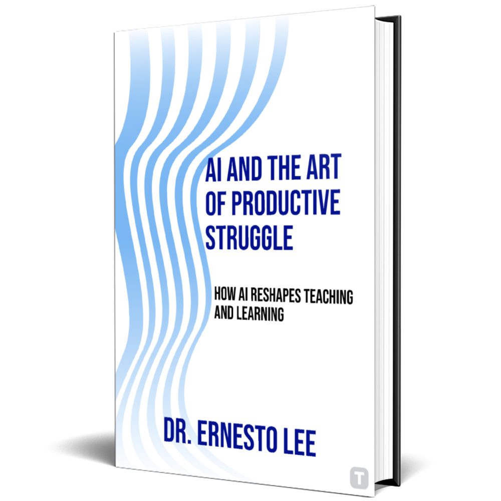

# AI and the Art of Productive Struggle

<p align="center">
  
</p>

## About the Book

"AI and the Art of Productive Struggle" is a groundbreaking book by Dr. Ernesto Lee that explores the critical intersection of artificial intelligence and education. In an age where AI tools promise instant answers and frictionless learning, this book challenges conventional wisdom by demonstrating how cognitive effort—the productive struggle—remains essential to meaningful education.

### The Core Thesis

The book introduces the "Friction Paradox" - the counterintuitive principle that sometimes, making learning more difficult creates deeper, more durable understanding. Dr. Lee provides a comprehensive framework for educators to harness AI not as a shortcut, but as a tool to create richer, more challenging learning experiences.

## Website Overview

This repository contains the official website for "AI and the Art of Productive Struggle" by Dr. Ernesto Lee. The website serves as a comprehensive resource for readers, educators, and educational technology professionals interested in the book's concepts.

### Key Features

- **Interactive Chapter Preview** - Experience Chapter 1: "The Friction Paradox" with an interactive page-flip interface
- **About the Author** - Learn about Dr. Ernesto Lee's academic credentials, speaking engagements, and personal story
- **Book Highlights** - Explore the ten transformational chapters and their key concepts
- **Testimonials** - Read endorsements from leading experts in education and AI
- **Modern, Responsive Design** - Optimized for all devices from mobile to desktop

## Website Structure

The website is built with modern web technologies:

- **Framework**: Next.js 14
- **UI**: React with Tailwind CSS and DaisyUI
- **Animations**: Framer Motion
- **Special Features**: Interactive page flip (react-pageflip), responsive layouts

## Getting Started

Follow these steps to run the website on your local machine:

1. Clone the repository:
   ```bash
   git clone [your-repository-url]
   ```

2. Navigate to the project directory:
   ```bash
   cd prodstruggle
   ```

3. Install dependencies using PowerShell:
   ```powershell
   npm install
   ```

4. Start the development server:
   ```powershell
   $env:PORT=3000; npm run dev
   ```

5. Open your browser and visit:
   ```
   http://localhost:3000
   ```

## Project Structure

```
/app                     # Next.js app directory structure
  /about-author         # About Dr. Ernesto Lee page
  /chapter-1-preview    # Interactive chapter preview page
/components             # Reusable React components
  /Chapter1PageFlip.tsx # Interactive book flip component
  /Hero.tsx             # Main landing page hero section
  /Problem.tsx          # Problem statement section
  /SocialProof.tsx      # Testimonials and social proof
  /ChapterShowcase.tsx  # Chapter overview section
/public                 # Static assets including images
```

## About the Author

**Dr. Ernesto Lee** is a distinguished educator and researcher at the intersection of artificial intelligence and educational pedagogy. With over 1,600 academic citations and 37+ peer-reviewed publications, Dr. Lee brings decades of experience to his exploration of AI's role in education.

Highlights from his career include:

- Visiting Professor at leading universities worldwide
- Regular speaker at educational technology conferences
- Advisor to educational institutions on AI integration
- Recipient of multiple teaching excellence awards

Dr. Lee was inspired to write this book after a late-night realization at 2:47 AM that AI tools were fundamentally changing how students learn—often not for the better.

## Deployment

To deploy this website to production:

1. Build the production version using PowerShell:
   ```powershell
   npm run build
   ```

2. The build output will be generated in the `.next` folder.

3. For hosting options:
   - Deploy to Vercel (recommended for Next.js projects)
   - Deploy to Netlify (excellent alternative)
   - Self-host on your own server

4. Configure your environment variables in your hosting platform to match your development `.env` file.

## Key Website Features

### Interactive Chapter 1 Preview

The website features an innovative page-flip interface for Chapter 1: "The Friction Paradox." Visitors can experience the book's opening chapter with realistic page turning animations, navigation controls, and responsive design that works across all devices.

Highlights:
- Animated page turning effects
- Previous/Next navigation buttons
- Call-to-action buttons for purchasing the full book
- Social sharing functionality

### About the Author Page

The "About the Author" section provides comprehensive information about Dr. Ernesto Lee, establishing his credibility as an educator and researcher. The page includes:

- Professional headshot and biography
- Academic credentials including citations and publications
- Speaking engagements and industry recognition
- The personal story behind the book's creation
- Educational background and qualifications

### Social Proof and Testimonials

The website showcases endorsements from leading educators and AI experts who have reviewed the book. Each testimonial includes:

- Reviewer image
- Quoted excerpt of their review
- Name and credentials of the reviewer

### Chapter Showcase

A comprehensive overview of all ten chapters, highlighting the transformational journey readers will experience. Each chapter is presented with:

- Chapter title
- Key transformation concept
- Value proposition
- Core insight

## Contributing

Contributions to improve the website are welcome. To contribute:

1. Fork the repository
2. Create a feature branch (`git checkout -b feature/amazing-feature`)
3. Commit your changes (`git commit -m 'Add some amazing feature'`)
4. Push to the branch (`git push origin feature/amazing-feature`)
5. Open a Pull Request

## License

This website is copyrighted material for "AI and the Art of Productive Struggle" by Dr. Ernesto Lee. All rights reserved. The code structure is provided as an example of Next.js implementation but content and design elements are not licensed for reuse without permission.

## Technical Features

- **Modern Web Technologies**: Built with Next.js 14, React, and TypeScript
- **Responsive Design**: Fully responsive with Tailwind CSS and DaisyUI
- **Engaging Animations**: Smooth transitions and effects with Framer Motion
- **Interactive Elements**: Custom page-flip interface using react-pageflip
- **Optimized Performance**: Fast loading and rendering
- **SEO Optimized**: Comprehensive metadata and semantic markup

## Contact

For inquiries about the book or website, please contact:

- **Email**: [contact@artofproductivestruggle.com](mailto:contact@artofproductivestruggle.com)
- **Website**: [www.artofproductivestruggle.com](https://www.artofproductivestruggle.com)

---

&copy; 2025 Dr. Ernesto Lee. All Rights Reserved.
